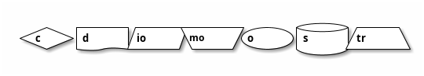
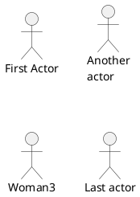

* 建構自 [MF林明樟 超級數字力 線上課程](https://sat.cool/classroom/28)

## 總論

```plantuml
@startditaa

+-------+                              
| 損益表 |                         +-----------+
+-------+                         | 資產負債表  |
                                  |           |
                                  +-----------+ 
+-----------------------------+
|               |             |
|               |             |
|               |-------------+         
|               |             |
|               |             |
|               |             |
+---------------+-------------+   

@endditaa
```

```plantuml
@startditaa
+------+------+------+------+------+------+------+
| c {c}|d {d} |io{io}|mo{mo}|o{o}  |s{s}  |tr{tr}|
+------+------+------+------+------+------+------+
@endditaa 
```

```plantuml
@startuml

:First Actor:
:Another\nactor: as Man2
actor Woman3
actor :Last actor: as Person1

@enduml
```

## 損益表

## 現金流量表

## 資產負債表